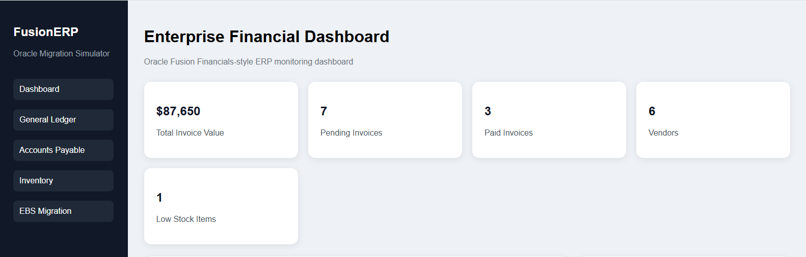
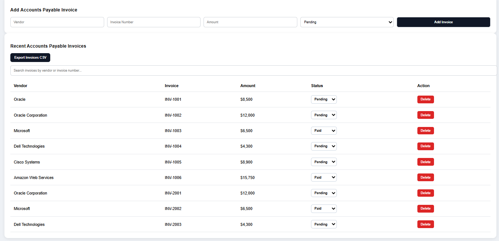
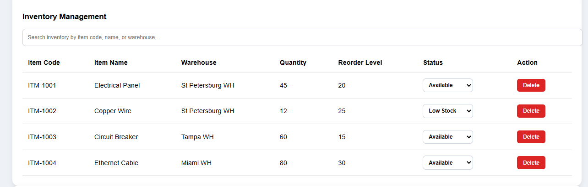
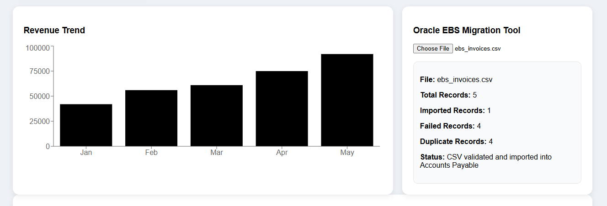
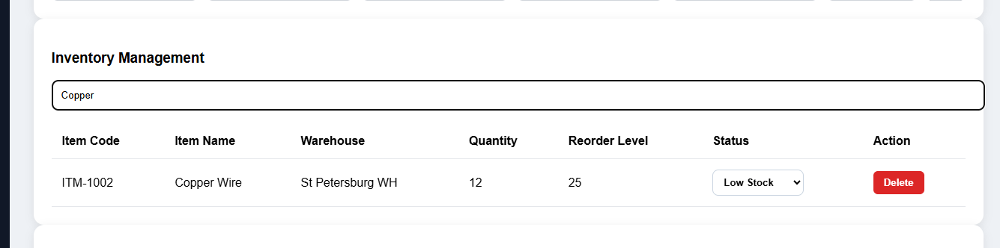
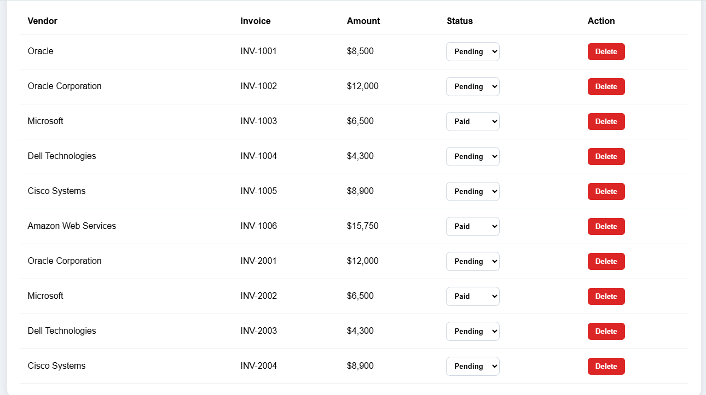

# FusionERP Mini
### Oracle Fusion Financials Migration Simulator

FusionERP Mini is a full-stack ERP simulation project inspired by Oracle Fusion Financials. The application demonstrates Accounts Payable processing, Inventory Management, Oracle EBS invoice migration, analytics dashboards, and REST API integration using FastAPI and React.

This project was developed to demonstrate enterprise software engineering concepts including CRUD operations, database integration, CSV migration workflows, dashboard analytics, REST APIs, and frontend/backend communication.

---

# Features

## Enterprise Dashboard

- Oracle Fusion styled ERP dashboard
- Financial KPI cards
- Revenue analytics
- Low stock monitoring
- Vendor statistics
- Pending invoice tracking

---

## Accounts Payable

- Add invoices
- Delete invoices
- Update invoice status
- Search invoices
- Export invoices to CSV
- Dashboard statistics

---

## Inventory Management

- Add inventory items
- Delete inventory items
- Update inventory status
- Search inventory
- Low stock detection

---

## Oracle EBS Migration Simulator

- Upload legacy invoice CSV
- Validate required columns
- Detect duplicate invoices
- Import invoices into database
- Migration summary

Example summary:

- Total Records
- Imported Records
- Failed Records
- Duplicate Records
- Missing Columns
- Migration Status

---

## REST APIs

FastAPI backend exposes APIs for:

- Invoice Management
- Inventory Management
- Status Updates
- Oracle Migration Upload

Interactive Swagger UI:

```
http://127.0.0.1:8000/docs
```

---

# Technology Stack

## Frontend

- React
- Vite
- Axios
- Recharts
- CSS

---

## Backend

- FastAPI
- SQLAlchemy
- SQLite
- Pandas
- Uvicorn

---

# System Architecture

```
React Dashboard
       │
       │ Axios
       ▼
FastAPI REST API
       │
       ▼
SQLAlchemy ORM
       │
       ▼
SQLite Database
```

---

# Project Structure

```
FusionERP-Mini/

backend/
│
├── main.py
├── crud.py
├── models.py
├── schemas.py
├── database.py
├── fusionerp.db
├── requirements.txt
│
frontend/
│
├── src/
│   ├── App.jsx
│   ├── main.jsx
│   ├── App.css
│   └── assets/
│
├── package.json
│
sample-data/
│
├── invoices.csv
├── inventory.csv
│
screenshots/
│
├── dashboard.png
├── accounts-payable.png
├── inventory.png
├── migration.png
├── search.png
├── status-update.png
│
README.md
```

---

# Dashboard Features

### KPI Cards

- Total Invoice Value
- Pending Invoices
- Paid Invoices
- Vendor Count
- Low Stock Items

---

### Revenue Analytics

Interactive revenue trend using Recharts.

---

### Oracle Migration

Upload legacy invoice CSV files and simulate Oracle EBS to Fusion Financials migration.

---

### Inventory

Manage warehouse inventory including:

- Item Code
- Warehouse
- Quantity
- Reorder Level
- Status

---

### Accounts Payable

Manage supplier invoices with:

- Vendor
- Invoice Number
- Amount
- Status

---

# Screenshots

## Dashboard



---

## Accounts Payable



---

## Inventory Management



---

## Oracle Migration



---

## Search Functionality



---

## Status Updates



---

# API Endpoints

## Invoice APIs

| Method | Endpoint | Description |
|---------|----------|-------------|
| GET | /invoices | List invoices |
| POST | /invoices | Create invoice |
| PUT | /invoices/{id}/status | Update status |
| DELETE | /invoices/{id} | Delete invoice |

---

## Inventory APIs

| Method | Endpoint | Description |
|---------|----------|-------------|
| GET | /inventory | List inventory |
| POST | /inventory | Create inventory |
| PUT | /inventory/{id}/status | Update status |
| DELETE | /inventory/{id} | Delete inventory |

---

## Migration

| Method | Endpoint |
|---------|----------|
| POST | /migration/upload |

---

# Installation

## Backend

```bash
cd backend

python -m venv venv

venv\Scripts\activate

pip install -r requirements.txt

uvicorn main:app --reload
```

Backend runs at

```
http://127.0.0.1:8000
```

Swagger

```
http://127.0.0.1:8000/docs
```

---

## Frontend

```bash
cd frontend

npm install

npm run dev
```

Runs at

```
http://localhost:5173
```

---

# Sample CSV Format

## Invoice CSV

```csv
vendor,invoice_number,amount,status
Oracle,INV-1001,8500,Pending
Microsoft,INV-1002,6500,Paid
Dell,INV-1003,4300,Pending
```

---

## Inventory CSV

```csv
item_code,item_name,warehouse,quantity,reorder_level,status
ITM-1001,Electrical Panel,St Petersburg WH,45,20,Available
ITM-1002,Copper Wire,St Petersburg WH,12,25,Low Stock
```

---

# Future Enhancements

- User Authentication
- Role Based Access Control
- Purchase Orders
- General Ledger Module
- Accounts Receivable
- Supplier Portal
- PDF Invoice Generation
- Docker Deployment
- Cloud Database
- CI/CD Pipeline
- JWT Authentication
- Audit Logs
- Email Notifications

---

# Learning Outcomes

This project demonstrates:

- Full Stack Development
- Enterprise REST APIs
- FastAPI
- React
- SQLAlchemy ORM
- SQLite Database Design
- CRUD Operations
- CSV Migration
- Data Validation
- Dashboard Analytics
- State Management
- Axios API Integration
- Enterprise UI Design

---

# Author

**Naga Prem Sai Nellure**

GitHub:
https://github.com/Premsai8991

LinkedIn:
https://linkedin.com/in/nellure-naga-prem-sai

---

## License

This project is intended for educational, portfolio, and demonstration purposes.